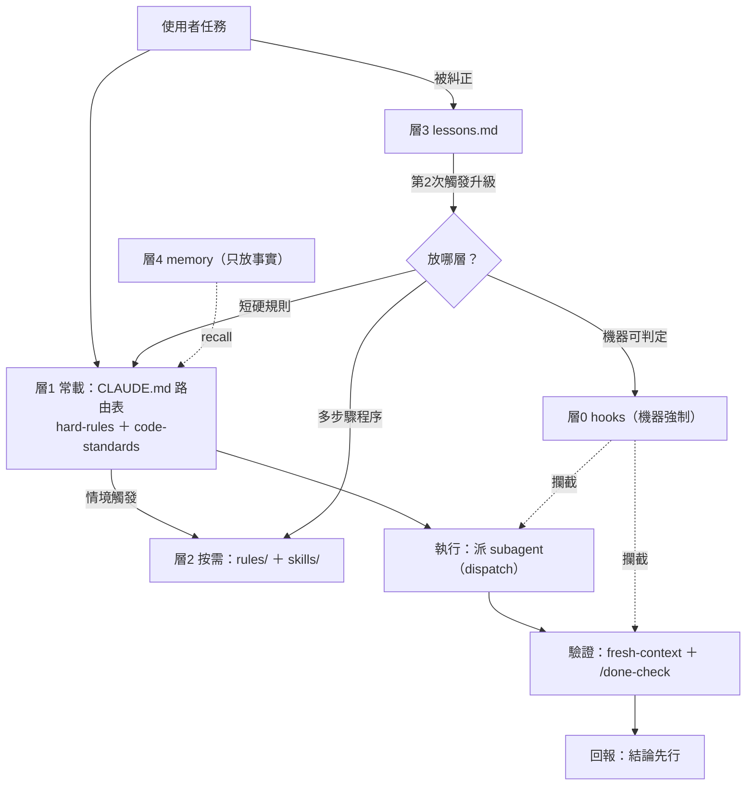

# claude-institution — 讓 Claude Code 有制度地工作

一套 Claude Code 跨專案制度：分層規則（hook→常載→按需→lessons）＋機器強制驗證＋
自我改進迴圈。目標：**弱模型也能穩定交出有證據的高品質產出**，而不是把品質賭在
單次 prompt 與模型自律上。

## 它解決什麼問題

Claude Code 日常四大痛點：

1. **假完成**——回報「✅ 測試通過」卻根本沒跑過任何指令。
2. **規則不被遵守**——CLAUDE.md 寫了一大篇，模型看過就忘、挑著遵守。
3. **額度燒在粗活**——貴模型的 context 被讀檔、搜尋、貼長輸出塞爆，重複計費又失焦。
4. **糾正不累積**——同一個錯誤，每個新 session 再犯一次。

## 它給你什麼（好處 → 機制 → 在哪）

| 好處 | 靠什麼機制 | 在哪 |
|---|---|---|
| 「完成」必附實跑指令與輸出，假完成被攔下 | `/done-check` checklist ＋ `verify_gate` Stop hook 攔「改了碼未驗證就收工」 | `skills/done-check/`、`hooks/` |
| 規則真的被遵守——強制力來自放對層，不是寫得多 | 制度分層：機器可判定→hook（模型跳不過）；每次必守→常載；程序→按需載入 | `CLAUDE.md` 分層表 |
| 額度花在刀口——粗活派便宜模型，貴模型只做判斷 | 指揮官不下場＋調度表＋升降級路徑＋派工標明模型 | `rules-lib/dispatch.md` |
| 同一個錯不犯第二次——糾正複利成制度 | lesson 迴圈：記錄→第 2 次觸發→升級固化到 hook／常載／skill | `skills/lesson/` |
| 高風險判斷不靠單次直覺 | 判準先行、多答案評審、對抗自查三鏡頭（skeptic／red-team／simplifier） | `rules-lib/uplift.md`、`agents/` |
| 災難級誤操作被機器擋下，不靠模型自律 | 層 0 hooks：`rm_guard`／`backup_gate`／`commit_guard`（fail-open） | `hooks/` |
| 整套制度可攜、可版本控管、可一鍵還原 | 本 repo 快照＋`restore.sh`（覆寫前自動備份） | `restore.sh` |

**誠實邊界**：制度補的是流程性判斷（防偏誤、防漏做、防過度自信），補不了模型本體的
品味與長鏈推理；量化的能力轉移比例目前是推測值，見 `docs/capability-transfer-assessment.md`。

## 快照與正本

- **正本**在 `~/.claude/`（`CLAUDE.md`、`rules/`、`skills/`）與
  `~/.claude/projects/-Users-<username>-GitHub-claude-institution/memory/`。
  制度靠正本運作：每個新 session 由 `~/.claude/CLAUDE.md` 經 `@import` 載入常載規則。
- **本專案 `institution/` 是複製快照**（2026-07-05 由一次性 Fable 5 session 建立），
  不是運作中的檔案。用途：可攜、可版本控管（git）、可災難還原（`restore.sh`）。
  改快照不會影響任何 session；要改制度請改正本。

## 設計理念（一句話）

規則的強制力來自「放對層」，不是寫得多。機器可判定 → hook；每次必守的短規則 → 常載；
多步驟程序與範例 → 按需檔／skill；被糾正 → lessons.md，第 2 次觸發就升級固化。
讀者是較弱的模型，所以每條規則都力求「具體、可執行、有 if-then 判準與正反例」。

## 制度如何運作

### 任務生命週期（一次任務走的路）

1. **起手＋接單**：讀專案 `tasks/lessons.md`，一句話複述任務範圍＋完成判準（CLAUDE.md
   起手式）；動手前查 XY problem 與 scope 校準，各 ≤2 分鐘（`intake.md`）。
2. **路由**：查 CLAUDE.md 路由表 → 按需讀 `rules/` 或用 skill；常載僅 hard-rules＋code-standards。
3. **執行**：指揮官不下場，粗活派 subagent（#11、`dispatch.md`）；派工顯式指定模型並在描述標明「agent 類型＋模型」。
4. **驗證**：修改者不自驗，派 fresh-context agent read-back 或實跑（#12）；寫入後印磁碟實態（#15）。
5. **收尾**：宣稱完成前走 `/done-check`（每個 ✅ 附指令與輸出）→ 回報結論先行（`reporting.md`）。

### 自我改進迴圈（制度怎麼長大）

- 被糾正 → `/lesson` 記入 `tasks/lessons.md`（層 3）；同一教訓**第 2 次觸發** → 依分層升級：
  機器可判定→hook（層 0）；1–2 行硬規則→常載（層 1）；多步驟程序→skill／按需檔（層 2）。
- 升級受 `maintenance.md` 權限分級管制（核心檔動前先問使用者）；閉環實例：hard-rules #15＝假同步教訓二次觸發的升級產物。

### 層 0 攔截時序（hooks，機器強制，全部 fail-open）

UserPromptSubmit（`prompt_nudge` 提醒）→ PreToolUse（`backup_gate` 攔無備份改制度檔／
`commit_guard` 攔除錯碼 commit／`rm_guard` 攔災難級刪除）→ Stop（`verify_gate` 攔改了碼未驗證就收工）。細節見下方檔案清單。

條文衝突優先序：誠實條款（judgment.md）> hard-rules > 按需檔/skills > lessons.md（hooks 機器強制，不參與排序）。

分層互動圖：



## 檔案清單（快照內容，共 26 檔）

### institution/CLAUDE.md
索引式主檔（≤150 行）：起手式、路由表、制度分層表，`@import` 兩個常載檔。

### institution/rules/（12 檔）
| 檔案 | 載入方式 | 內容 |
|---|---|---|
| `hard-rules.md` | 常載（@import） | 硬規則 #0–15：元規則、行為、調度、回報、寫入查證、計畫、Git |
| `code-standards.md` | 常載（@import） | In-file Structure、Core Principles、檔頭要求（模板見 code-header.md） |
| `code-header.md` | 按需 | File Docstring 完整模板；建立新原始碼檔時讀 |
| `dispatch.md` | 按需 | 模型調度守則、升降級路徑、驗證不自驗 |
| `judgment.md` | 按需 | 五個 rubric：升級／完成／問人／換路／品質底線，各附正反例 |
| `uplift.md` | 按需 | 判斷力增強協定：六個方法把單次直覺換成可檢驗流程 |
| `prompt-templates.md` | 按需 | 五種交辦範本：搜尋／實作／重構／研究／審查 |
| `diagnosis.md` | 按需 | 本 harness 三大耗損源與弱模型可照做的修法 |
| `maintenance.md` | 按需 | 制度檔維護：權限分級、精簡門檻、過期檢查 |
| `intake.md` | 按需 | 需求端判斷：XY problem 反建議、scope 校準（動手前兩檢查） |
| `design-heuristics.md` | 按需 | 動手前的正向設計指引：rule of three、先寫呼叫端、錯誤處理三選一等 |
| `reporting.md` | 按需 | 指揮官對使用者的回報規則：結論先行、選擇性省略、決策選項化 |

### institution/skills/（3 個 SKILL.md）
- `done-check` — 宣稱完成前的驗證 checklist，每個 ✅ 必附指令與輸出
- `lesson` — 被糾正後把教訓寫成 if-then 規則，含第 2 次觸發的升級程序
- `debug-protocol` — 系統化除錯 + 假設生成優先序 + 3-strike 停損規則

### institution/hooks/（5 檔，層 0 機器可判定規則）
借鑑自 Miguok/fable-harness 的同款機制，判斷邏輯保留、訊息改寫成指向本專案自己的規則；
不引入 fable 的 FABLE-PROTOCOL 命名或協定文字。
- `verify_gate.py` — Stop hook。本回合動了程式碼卻無測試指令 → 擋下並指向
  `hard-rules.md` #5 與 `/done-check`；fail-open，任何例外一律放行。
- `prompt_nudge.sh` — UserPromptSubmit hook。每回合一行提醒（指揮官不下場／
  /done-check／對抗審查），內容綁定本專案制度。
- `backup_gate.py` — PreToolUse hook（Edit/Write/NotebookEdit）。改動
  `~/.claude/` 制度檔前若今日無備份 → 擋下並提示備份指令；fail-open。
- `commit_guard.py` — PreToolUse hook（Bash git commit）。staged diff
  新增行含 console.log/debugger 等除錯碼 → 擋下；找不到 `git` 時 fail-open。
- `rm_guard.py` — PreToolUse hook（Bash rm/rmdir/find -delete）。命中
  `/`、`~`、`/Users/*` 等災難級路徑或未防呆的變數開頭遞迴刪除 → 擋下；
  fail-open（單一片段解析失敗且含 rm 時改保守 regex 擋，不直接放行）。

### institution/agents/（3 個對抗審查 subagent）
同樣借鑑自 fable-harness，指示改為引用 `rules-lib/uplift.md` 方法 2（多答案評審）／
方法 3（對抗自查）。**正本放在 `~/.claude/agents/`，但該目錄已是第三方
`wshobson/agents` 的 git clone**——三個檔名已加進該 clone 的
`.git/info/exclude`，避免污染其 git status 或被 `git clean` 誤刪；
真正的還原保障是這份快照 + `restore.sh`。
- `skeptic.md` — 正確性鏡頭，預設「推翻它」，找邏輯漏洞與反例
- `red-team.md` — 安全／失效模式鏡頭，固定 5 項攻擊清單
- `simplifier.md` — 過度工程鏡頭，須提出實際簡化程式碼

### institution/memory/（2 檔）
- `institution-map.md` — 制度結構指標，供 recall
- `MEMORY.md` — memory 索引

### repo 其他內容（非快照，不隨 restore.sh 還原）

- `docs/capability-transfer-assessment.md` — 能力轉移評估基線（Opus＋制度 ≈ Fable 的
  多少 %；⚠️ 推測值，待 eval 量測校正）。
- `eval/` — 制度蒸餾最小評測集（6 題＋fixtures＋答案卷）；只在制度改版時跑，
  用法見 `eval/README.md`。
- `tasks/` — 本 repo 自己的 lessons.md 與 todo.md。

## 執行需求（Python 與 git）

`institution/hooks/` 下的每個 `.py` hook 都以 `#!/usr/bin/env python3` 執行，需要：

- **Python 3.8 以上**（`backup_gate.py`、`commit_guard.py`、`verify_gate.py`、
  `rm_guard.py` 皆宣告 3.8+）。
- **僅用 Python 標準函式庫，不需要 `pip install` 任何套件**：實際用到的模組是
  `datetime / json / os / re / shlex / subprocess / sys / traceback`，全部內建。
- **`commit_guard.py` 額外需要 PATH 上有 `git`**；找不到 `git` 時該 hook
  fail-open（放行，不阻擋）。

**平台備註**：全新 macOS 在安裝 Xcode Command Line Tools 之前，`/usr/bin/python3`
只是個會提示安裝 CLT 的樁，不是可用的直譯器；多數 Linux 發行版預設已內建 python3。

**缺 Python 時會怎樣**：hook 無法執行，其防護即失效。但 `~/.claude/settings.json`
的 `permissions.deny` 規則（例如擋 `rm -rf /`、`rm -rf ~`）由 Claude Code 自身
解析，不經任何外部直譯器，即使 Python 不存在也照常生效——這層是不依賴 Python 的
最後防線。
（待確認：hook 因直譯器缺失而無法執行時，Claude Code 對非 0 非 2 exit code
的處理是否確實為「放行」而非「阻擋」，本專案尚未實測驗證。）

## 如何還原到 ~/.claude/

```bash
bash restore.sh
```

腳本會把 `institution/` 的 `CLAUDE.md`、`rules/`、三個 `skills/`、`agents/`
複製回 `~/.claude/`，**覆寫前先把現有檔備份到 `~/.claude/backups/restore-<timestamp>/`**。
`hooks/` **預設略過**：快照 hooks 是去識別化版本（email/username 為 placeholder），
整包還原會劣化正本；確定要還原加 `--with-hooks`（還原後自動補可執行位元，
記得回填個人化欄位）。
memory 因路徑含專案名、屬 project-scope，腳本只印提示、不自動覆寫。

## 唯一未確認事項

「被安全機制導向到 Opus 4.8 的請求是否消耗當前窗口額度」——本環境查不到，未確認。
建議到 claude.ai 的 usage 儀表板實測。詳見 `tasks/todo.md` 弱點路線圖第 7 項。
（`@import` 是否於新 session 生效已於 2026-07-05 用 `claude -p` 實測確認。）
